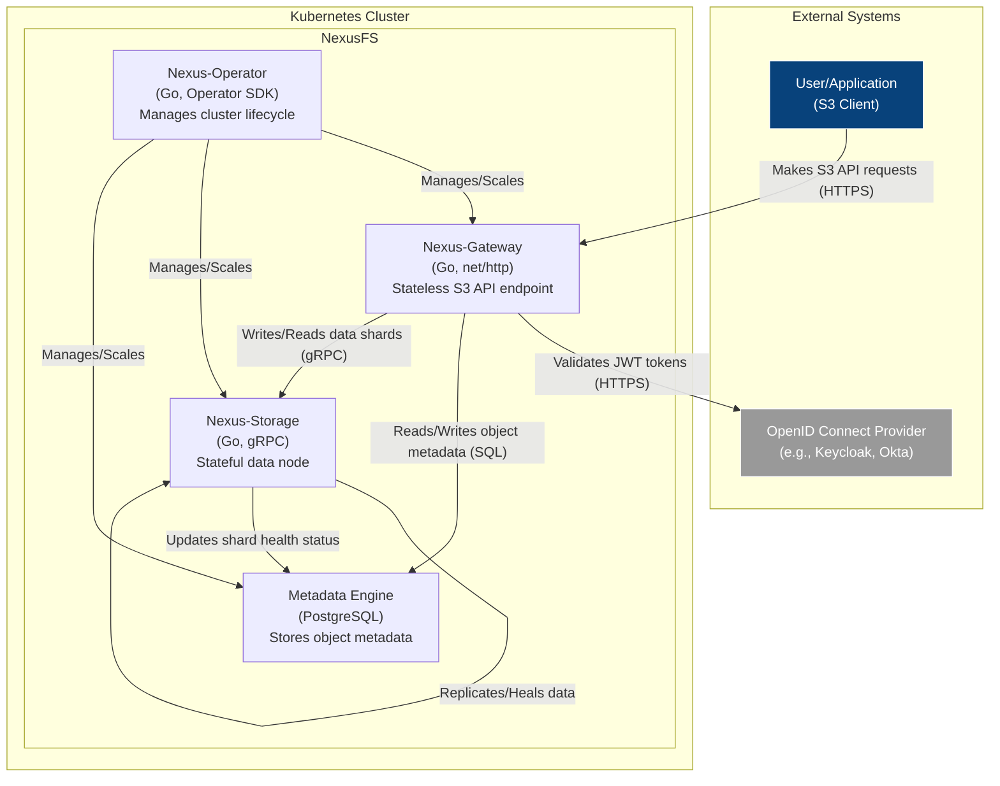
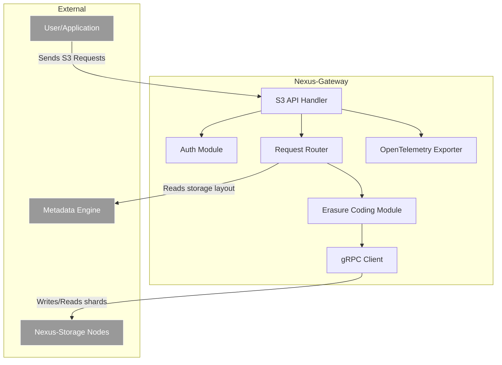
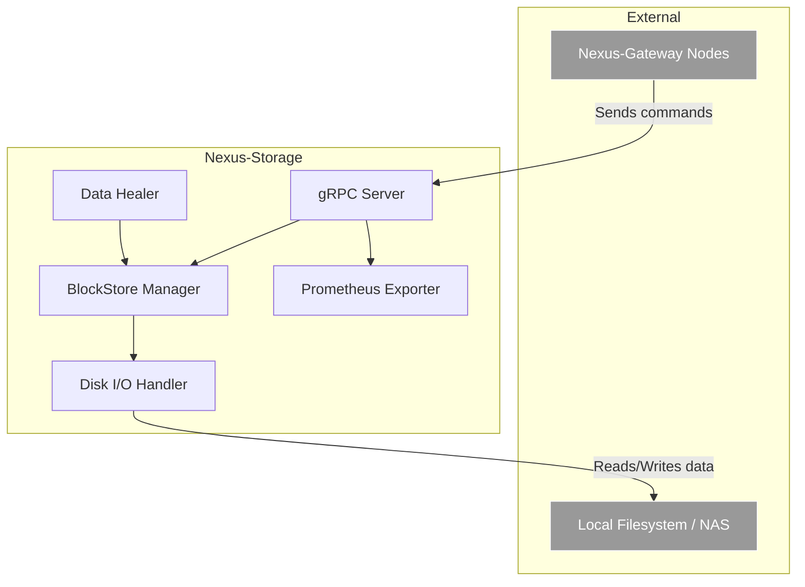

# NexusFS Architecture

## 1. Overview

NexusFS is a next-generation, cloud-native object storage system designed for hyper-scalability, extreme data reliability, and deep observability. It is engineered to be a powerful, open-source alternative to established systems like MinIO and Ceph, with 100% S3 API compatibility as a core tenet.

Built from the ground up for Kubernetes, NexusFS features a decoupled, stateless architecture that allows for independent scaling of gateway and storage layers. It integrates robust Erasure Coding, automated cluster management via a Kubernetes Operator, and comprehensive observability through OpenTelemetry, making it suitable for mission-critical, enterprise-grade workloads.

**Core Principles:**
- **S3 Compatibility:** Full support for the core Amazon S3 API.
- **Cloud-Native:** Designed for Kubernetes, managed via a dedicated Operator.
- **Scalability:** Stateless, horizontally scalable components.
- **Data Durability:** Advanced Erasure Coding with automated data healing.
- **Observability:** Rich metrics, traces, and logs out-of-the-box.
- **Extensibility:** Abstracted storage backend for future integration with public clouds.

---

## 2. System Architecture (C4 Model)

The NexusFS architecture is composed of several key systems that work in concert to provide a unified object storage service.

### 2.1. Container Diagram

This diagram illustrates the high-level containers (applications/services) within the NexusFS ecosystem and their primary interactions.



### 2.2. Component Diagram - Nexus-Gateway

The Gateway is stateless and responsible for handling all incoming S3 traffic.



### 2.3. Component Diagram - Nexus-Storage

The Storage node is stateful and manages the low-level details of storing data blocks.



---

## 3. Technology Selection & Justification

### 3.1. Metadata Engine

**Choice:** **PostgreSQL**

**Justification:**
While lightweight key-value stores like ETCD are excellent for cluster coordination, they are not optimized for the complex metadata queries required by a modern object storage system. MinIO's use of a simple on-disk format can limit its capabilities for advanced, enterprise features.

PostgreSQL is chosen for the following reasons:
- **Powerful Querying:** It provides a rich SQL interface, enabling complex queries for features like object versioning, lifecycle management (e.g., "delete objects older than 90 days with tag 'temp'"), and detailed analytics.
- **Strong Consistency (ACID):** Guarantees that metadata operations are atomic and durable, which is critical for maintaining data integrity. A metadata write is only committed after the data shards are successfully written, preventing orphaned data.
- **Maturity & Reliability:** PostgreSQL is a battle-tested, highly reliable database with a vast ecosystem of tools for backup, replication, and management.
- **Extensibility:** Supports custom data types and extensions, which can be leveraged for future features.

In contrast to TiKV, which is a powerful distributed KV store, PostgreSQL provides a more familiar and powerful data model for our initial needs, while still being highly scalable with solutions like Patroni or managed cloud offerings.

### 3.2. Networking & Protocol

- **Gateway (External):** `net/http`. This is the standard Go library for building HTTP services and ensures maximum compatibility with the S3 specification and existing client SDKs.
- **Internal (Service-to-Service):** `gRPC`. Chosen for its superior performance over REST/JSON. Its use of Protocol Buffers and HTTP/2 provides low-latency, high-throughput communication between the Gateway and Storage nodes. Features like bidirectional streaming are ideal for large object uploads/downloads.

### 3.3. Data Redundancy

**Choice:** `Klauspost/galactus` (a fork or inspiration from `klauspost/reedsolomon`)

**Justification:**
Data redundancy is the cornerstone of NexusFS. We will implement Erasure Coding (EC) as the primary data protection mechanism.
- **Efficiency:** EC provides a much higher level of storage efficiency compared to simple replication. For a `4+2` EC scheme, the storage overhead is only 50%, whereas 3x replication incurs a 200% overhead.
- **Durability:** EC provides higher data durability for the same amount of redundancy. A `4+2` scheme can tolerate any 2 shard failures, while 3x replication can only tolerate 2 specific failures.
- **Library Choice:** The `klauspost/reedsolomon` library is the de-facto standard for high-performance Reed-Solomon Erasure Coding in Go. It is heavily optimized, using SIMD instructions (AVX2, SSSE3) to achieve line-speed encoding and decoding.
- **Security Assessment:** Data is secure by default. An attacker gaining access to a single storage node cannot reconstruct any object data, as they would only have a meaningless data shard. A quorum of shards is required for reconstruction.

### 3.4. Object Storage Abstraction

To ensure high cohesion and loose coupling, we will define two core interfaces. This design is inspired by successful patterns in systems like MinIO and Thanos.

- **`ObjectStore` Interface:** A high-level abstraction for object operations. It understands objects, buckets, and prefixes. The Gateway will primarily interact with this interface.
  ```go
  // Simplified for illustration
  type ObjectStore interface {
      PutObject(ctx context.Context, bucket, object string, data io.Reader, opts PutOptions) error
      GetObject(ctx context.Context, bucket, object string) (io.ReadCloser, error)
      // ... other S3 operations
  }
  ```
- **`BlockStore` Interface:** A low-level abstraction for shard/block management. The Storage nodes will implement this interface. It deals with raw byte slices and block IDs.
  ```go
  // Simplified for illustration
  type BlockStore interface {
      WriteShard(ctx context.Context, shardID string, data []byte) error
      ReadShard(ctx context.Context, shardID string) ([]byte, error)
      DeleteShard(ctx context.Context, shardID string) error
  }
  ```
This separation allows us to easily implement new backend `BlockStore`s (e.g., an `S3BlockStore` that writes to AWS S3, or an `AzureBlockStore`) without changing the core `ObjectStore` logic.

### 3.5. Observability

**Choice:** **OpenTelemetry**

**Justification:**
OpenTelemetry is the CNCF-backed industry standard for observability. By instrumenting NexusFS with the OpenTelemetry Go SDK, we gain:
- **Unified Instrumentation:** A single set of APIs for collecting traces, metrics, and logs.
- **Vendor Agnostic:** Export data to any compatible backend (Jaeger for traces, Prometheus for metrics, Loki for logs) without changing the code.
- **Distributed Tracing:** Automatically trace requests as they flow from the Gateway to Storage nodes and the Metadata engine, making it trivial to debug latency issues.
- **Comprehensive Metrics:** Expose detailed Prometheus metrics for S3 operations, gRPC latency, disk I/O, EC performance, and data healing activities.

### 3.6. Configuration

**Choice:** **Viper**

**Justification:**
Viper is a complete configuration solution for Go applications. It provides a unified way to handle configuration from multiple sources, which is essential for a cloud-native application. It supports:
1.  Environment variables (critical for Kubernetes deployments).
2.  Configuration files (e.g., `config.yaml`).
3.  Command-line flags.
This flexibility allows operators to manage configuration in a way that best suits their environment, from local development to production Kubernetes clusters.

---

## 4. Data Flow Design

### 4.1. PutObject Request Flow

This flow details the end-to-end process of writing a new object to NexusFS.

1.  **Request Reception:** A `Nexus-Gateway` node receives the `PUT /<bucket>/<object>` HTTP request from an S3 client.
2.  **Authentication:** The `Auth Module` inspects the request for credentials. If using JWT, it validates the token against the configured OpenID Connect provider's public keys.
3.  **Metadata Lookup & Routing:**
    - The Gateway queries the `Metadata Engine (PostgreSQL)` to get the bucket's storage policy (e.g., `EC 4+2`, `EC 6+3`).
    - The object name is hashed to consistently map it to an "Erasure Set" (a specific group of Storage Nodes).
4.  **Data Encoding & Streaming:**
    - The Gateway does not store the entire object in memory. It reads the incoming request body as a stream.
    - The stream is passed to the `Erasure Coding Module`, which splits it into chunks. Each chunk is encoded into `N` data shards and `M` parity shards (e.g., 4 data + 2 parity).
5.  **Concurrent Shard Writes:**
    - The Gateway's `gRPC Client` establishes connections to the `N+M` `Nexus-Storage` nodes in the target Erasure Set.
    - It concurrently streams each shard to its respective Storage Node via a `WriteShard` gRPC call.
6.  **Storage Node Persistence:** Each `Nexus-Storage` node receives its shard data. The `BlockStore Manager` writes the shard to the underlying filesystem and returns a success/failure response.
7.  **Metadata Commit:**
    - Once the Gateway has received a success confirmation from a quorum of Storage Nodes (e.g., at least 4 out of 6 for a `4+2` setup), it proceeds to commit the object's metadata.
    - A new row is written to the `objects` table in PostgreSQL, containing the object name, size, hash, and a mapping of each shard ID to its physical location (e.g., `{'shard_1': 'node_A:/path/to/shard'}`).
8.  **Success Response:** The Gateway sends a `200 OK` response to the S3 client. If the metadata commit fails, the Gateway will initiate a cleanup process to delete the orphaned shards.

### 4.2. Data Healing Process

Data healing is the automated background process that ensures data integrity against silent data corruption (bit rot) and hardware failures.

**Triggers:**
1.  **Proactive Scrubbing:** The `Nexus-Operator` periodically triggers a cluster-wide scrub.
2.  **Failure Detection:** A `Nexus-Storage` node fails a health check, or a read operation on a shard returns an I/O error. The Operator marks the node's shards as "degraded".

**Repair Workflow:**
1.  **Identification:** The `Nexus-Operator` or a designated `Nexus-Storage` node queries the `Metadata Engine` to find objects with missing or corrupted shards.
2.  **Reconstruction:**
    - For a given object, the system identifies the healthy shards in its Erasure Set.
    - It reads a quorum of the remaining shards (e.g., any 4 shards in a `4+2` set).
    - The `Erasure Coding Module` is used to reconstruct the missing/corrupted shard's data.
3.  **Placement:** The newly reconstructed shard is written to a new, healthy `Nexus-Storage` node.
4.  **Metadata Update:** The `Metadata Engine` is updated with the new location of the repaired shard. The old, corrupted shard location is marked for garbage collection.
5.  **Verification:** The system performs a read of the object to verify that the repair was successful. The process repeats until all degraded objects are healed.
